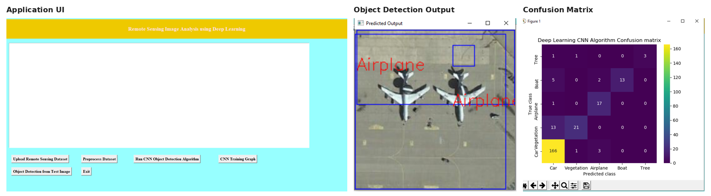

# Remote Sensing Image Analysis using Deep Learning

A desktop application that trains a convolutional neural network to detect and classify objects — cars, boats, airplanes, trees, and vegetation — in high-resolution aerial/satellite imagery, with a Tkinter GUI for running the full pipeline end to end.

<p align="center">
  
</p>


## Overview

Object detection in normal photographs is well studied, but far less work targets remote sensing (satellite/aerial) imagery, where objects are small, densely packed, and photographed from directly overhead. This project trains a CNN with two output heads — one predicting a bounding box, one predicting an object class — on the [RSSOD](https://data.mendeley.com/datasets/b268jv86tf/1) remote sensing dataset, and wraps the whole workflow (data loading, training, evaluation, single-image prediction) in a point-and-click desktop UI so the pipeline can be run without touching code.

## Highlights

- **Dual-head CNN** — a single convolutional backbone feeds two dense heads: a softmax regression head for bounding-box coordinates and a sigmoid head for multi-class object classification, trained jointly with combined MSE + binary cross-entropy loss.
- **Custom dataset pipeline** — reads RSSOD images alongside four sets of YOLO-format label files (1/2/4/5-class variants), normalizes bounding boxes to `[0, 1]`, and caches the processed tensors to disk (`.npy`) so subsequent runs skip reprocessing.
- **End-to-end GUI workflow** — five buttons take you from raw dataset to trained model to a live prediction: upload dataset → preprocess → train CNN → view training graph → detect objects in a new image.
- **Full evaluation suite** — accuracy, precision, recall, and F-score (macro-averaged) plus a Seaborn confusion matrix, computed automatically after training.

## Dataset

[RSSOD (Remote Sensing Salient Object Detection)](https://data.mendeley.com/datasets/b268jv86tf/1), with 5 object classes: **Car, Vegetation, Airplane, Boat, Tree**. Class balance is heavily skewed toward `Car` in the sample run captured below — worth accounting for if you retrain on the full set (e.g. class weighting or macro-averaged metrics, already used here for precision/recall/F-score).

Expected folder layout (create this yourself — the dataset isn't included in the repo):

```
Dataset/
├── RSSOD_train_HR/          # aerial images (.png)
└── YOLO_labels/
    ├── labels_1class/
    ├── labels_2classes/
    ├── labels_4classes/
    └── labels_5classes/
```

Each label folder holds one `.txt` per image (YOLO-style: class + box per line).

## Model

| Component | Setting |
|---|---|
| Backbone | 2× [Conv2D(32) → Conv2D(32) → MaxPool] → 2× [Conv2D(64) → Conv2D(64) → MaxPool] |
| Head 1 (bounding box) | Dense(64) → Dense(64) → Dense(20, softmax) |
| Head 2 (class) | Dense(64) → Dense(64) → Dense(5, sigmoid) |
| Loss | MSE (bbox) + binary cross-entropy (class) |
| Optimizer | Adam (lr = 1e-4) |
| Input size | 200 × 200 × 3 |
| Epochs | 30 (checkpointed on best validation loss) |

## Results

From the runs recorded in this repo's training history and app screenshots:

| Metric | Value |
|---|---|
| Training accuracy | ~91–93% (final logged epoch) |
| Validation accuracy | ~88–92% (final logged epoch) |
| Test accuracy | 85–89% (varies by run/split) |
| Precision / Recall / F-score (macro) | ~67–92% / ~59–76% / ~60–81% |

The gap between accuracy and the macro precision/recall/F-score reflects the class imbalance noted above — the model does well on the dominant `Car` class and worse on underrepresented ones like `Boat` and `Tree`.

## Getting Started

### 1. Install dependencies

There's no `requirements.txt` in the repo yet — install the packages `Main.py` imports:

```bash
pip install tensorflow keras opencv-python numpy pandas matplotlib seaborn scikit-learn
```

(Tkinter ships with standard Python on Windows; on Linux install `python3-tk` separately.)

### 2. Add the dataset

Download RSSOD from the link above and arrange it as shown in [Dataset](#dataset), as a sibling of the `model/` folder.

### 3. Run the app

```bash
cd model
python Main.py
```

or, on Windows, double-click `run.bat`.

### 4. Use the GUI, in order

1. **Upload Remote Sensing Dataset** — point it at your `Dataset` folder; it loads and caches images/labels, and plots the per-class image counts.
2. **Preprocess Dataset** — shuffles, normalizes, and splits into an 80/20 train/test set.
3. **Run CNN Object Detection Algorithm** — trains the model (or loads `model/cnn_weights.hdf5` if it already exists) and prints accuracy/precision/recall/F-score plus a confusion matrix.
4. **CNN Training Graph** — plots training vs. validation accuracy across epochs.
5. **Object Detection from Test Image** — pick any image from `testImages/` (or your own) and view the predicted bounding box and label.

## Project Structure

```
Image-Sensing-Remote-Analysis-Using-Deep-Learning/
├── model/
│   ├── Main.py            # GUI application + CNN training/inference pipeline
│   ├── bb.txt.npy         # Cached bounding-box array from a previous dataset load
│   └── cnn_history.pckl   # Saved training/validation accuracy & loss history
├── testImages/             # Sample aerial images for quick predictions (0.png – 13.png)
├── SCREENS.docx             # Step-by-step walkthrough with GUI screenshots
└── run.bat                  # Windows launcher (python Main.py)
```

## Tech Stack

Python · Keras/TensorFlow · OpenCV · scikit-learn · Seaborn · Matplotlib · Tkinter

## Known Issues / Roadmap

- `getBox()` is called inside `addBoxes()` but isn't defined anywhere in `Main.py` — the cold-start path (processing a dataset for the first time, with no cached `.npy` files) will raise a `NameError`. Needs implementing or restoring before a fresh dataset can be loaded.
- `label` is referenced (`label += 1`) in `uploadDataset()` without being initialized first — another latent bug on the same code path.
- The `history/` and `regenerator-runtime/` folders and `package.json`/`package-lock.json` at the repo root are leftover npm packages unrelated to this project (likely committed by accident) — safe to delete.
- Add a `requirements.txt` and a `.gitignore` (for `__pycache__`, `*.npy`, `*.hdf5`).
- Dataset paths and the trained-model path are currently hardcoded relative paths run from inside `model/`; parameterizing them (CLI args or a config file) would make the app easier to run from anywhere.
- Address the class imbalance (e.g., class weighting, oversampling minority classes) to bring up recall on `Boat` and `Tree`.

## Author

**Roshini Evangelin Tamanamu** — ML Engineer, M.S. Computer Science @ Purdue University Northwest
[GitHub](https://github.com/RoshiniEvangelin)
